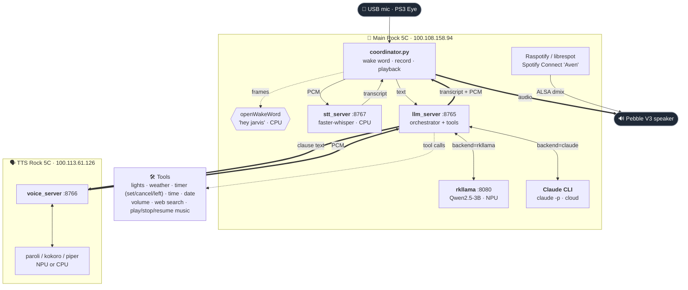
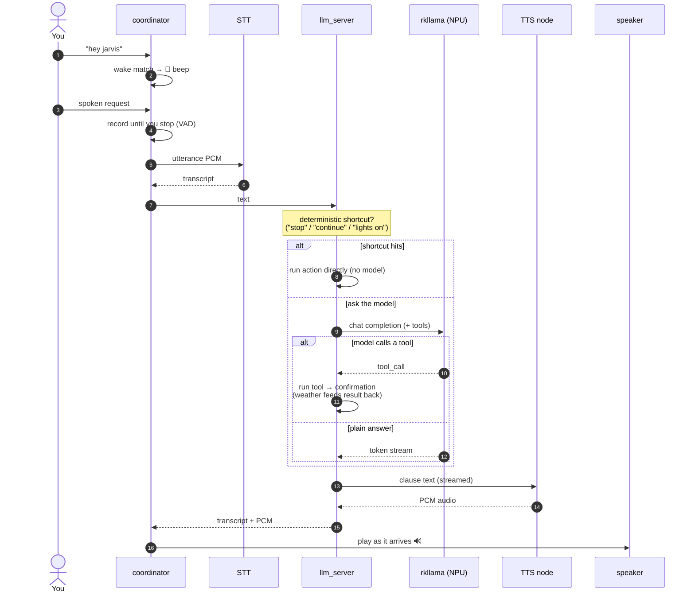

# Aven — a Rockchip NPU voice assistant

Aven is a self-hosted voice assistant that runs entirely on **Rock 5C** boards
(RK3588). You say *"hey jarvis"*, ask a question or give a command, and it
answers in a natural voice — using the **NPU** for the heavy stages (LLM, TTS)
and the **CPU** for the light ones (wakeword, speech-to-text). No cloud, no
accounts (except optional Spotify), nothing leaves your network.

It's built as **microservices** wired over WebSockets, so each stage can live on
its own board and the load spreads across two NPUs. One board runs the brain
(wakeword + STT + LLM + the mic/speaker loop); a second board runs text-to-speech.

**What it can do:** answer questions, control Tasmota smart plugs (*"turn off the
bed light"*), report the weather and time, set timers, and play/stop/resume
Spotify — all by voice, with conversation memory across turns.

## How it works

Everything is driven by the **coordinator** on the main board: it owns the mic
and speaker, listens for the wake word locally, and orchestrates the remote
stages over WebSockets. The **LLM node** (`llm_server`) is the hub — it talks to
the NPU model (`rkllama`), runs tool calls, and drives the **TTS node** on the
second board, relaying the synthesized audio back to the coordinator to play.



A single turn, end to end:



**Why clauses?** `llm_server` splits the model's token stream into speakable
clauses on the fly and pipes each to TTS as soon as it's ready, so audio starts
playing while the model is still talking — much lower latency than waiting for
the full reply.

> ⚠️ The TTS node runs on a **separate** board. Don't run the LLM and TTS
> engines on the same board at once — they each want the NPU.

## Repo layout

| Path | What runs there | UV project |
|------|-----------------|------------|
| [`config.yaml`](config.yaml) | Shared topology + settings (**edit this**) | — |
| [`config.py`](config.py) | Tiny loader imported by every service | — |
| [`coordinator/coordinator.py`](coordinator/coordinator.py) | **The voice loop** (mic → … → speaker) | `coordinator/` |
| [`LLM/llm_server.py`](LLM/llm_server.py) | LLM orchestrator + tools (main board) | `LLM/` |
| `LLM/rkllama/` | NPU LLM backend (submodule) | `LLM/rkllama/` |
| [`STT/stt_server.py`](STT/stt_server.py) | STT node (faster-whisper, CPU) | `STT/` |
| `wakeword/` | Standalone wakeword service (openWakeWord, CPU) | `wakeword/` |
| `TTS/voice_server.py` | TTS node — paroli (NPU VITS) | `TTS/` |
| `TTSV2/` · `TTSV3/` | Alt TTS — kokoro (NPU) · piper (CPU) | `TTSV2/` · `TTSV3/` |
| [`connector.py`](connector.py) | Text test client (laptop) | `./pyproject.toml` |
| [`start_main_board.sh`](start_main_board.sh) | Daemon manager for the main board | — |
| [`deploy/`](deploy/) | Host config: systemd unit, ALSA/Spotify | — |
| `.env.local` | Secrets (API keys) — **gitignored**, never committed | — |

Every service reads the **single `config.yaml`** at the repo root — no hardcoded
IPs in code. Change a host/port once and everything picks it up.

## Quick start (main board)

If the boards are already set up (see [per-node setup](#per-node-setup) for a
fresh install), the whole main-board stack is one command:

```bash
./start_main_board.sh            # start everything (skips what's already up)
./start_main_board.sh status
./start_main_board.sh restart coordinator
./start_main_board.sh stop
```

It starts `rkllama → llm_server → stt → coordinator` in order (waiting for
rkllama to load before the orchestrator), is idempotent, logs to `logs/`, and
loads secrets from `.env.local`. The TTS node runs on the other board, so it
isn't started here.

### Auto-start on boot (systemd)

[`deploy/aven.service`](deploy/aven.service) runs the stack at boot as your user:

```bash
sudo cp deploy/aven.service /etc/systemd/system/aven.service
sudo systemctl daemon-reload
sudo systemctl enable --now aven.service     # start now + on every boot
```

```bash
sudo systemctl start|stop|restart aven       # whole stack
systemctl status aven                         # cgroup shows all 4 services
journalctl -u aven                            # start/stop wrapper output
```

It's a `Type=oneshot` wrapper around `start_main_board.sh`, so per-service
control still goes through the script. An `ExecStartPre` waits up to 30 s for the
USB mic so the coordinator isn't skipped when USB enumerates a moment after boot.

## Per-node setup

Fresh boards only. Requires [UV](https://docs.astral.sh/uv/) and submodules:
`git submodule update --init --recursive`.

### 1. LLM node (main board — 100.108.158.94)

**Two brains, toggle in config.** `llm.backend` selects who answers:

- **`claude`** (default) — the installed [Claude CLI](https://claude.com/claude-code),
  using your own Claude auth (no API key); needs internet. `llm_server` keeps **one
  persistent `claude` process per conversation** (driven over `--input-format
  stream-json`), so the CLI starts once instead of per turn — warm turns are
  ~1.5–2 s, the prompt cache stays hot, and the process holds the multi-turn
  memory itself. Tool use is parsed from a JSON directive the model prints.
  Optionally pin a model with `llm.claude_model` (default `claude-haiku-4-5`,
  fast and cheap — a good fit for voice).
- **`rkllama`** — the fully-offline local NPU model (Qwen2.5-3B), set up below.

Flip `llm.backend` in [`config.yaml`](config.yaml) and restart `llm_server` — no
other change. Under `claude`, the daemon skips `rkllama` entirely (the NPU stays
free), and the coordinator log labels each turn `CLAUDE` vs `LLM` accordingly.
The rest of this section sets up the **rkllama** backend.

rkllama needs **Python 3.12** (its `rknn-toolkit-lite2` wheels stop at cp312) and
can't be launched with `uv run` directly (its pyproject declares the NPU wheel
with a relative `file:./…` URL uv refuses to parse). `setup_rkllama.sh` installs
it into a local venv (rewriting that URL to absolute for the install); the
orchestrator is a separate, lightweight UV project that talks to it over HTTP.

```bash
# a) one-time: install rkllama into LLM/rkllama/venv (downloads torch etc. — large)
bash LLM/setup_rkllama.sh

# b) rkllama NPU backend (serves http://0.0.0.0:8080)
cd LLM/rkllama && ./venv/bin/rkllama_server

# c) one-time: pull the model (second shell, server must be running)
cd LLM/rkllama && ./venv/bin/rkllama_client pull \
  c01zaut/Qwen2.5-3B-Instruct-rk3588-1.1.1/Qwen2.5-3B-Instruct-rk3588-w8a8-opt-0-hybrid-ratio-0.5.rkllm/qwen2.5-3b
# → the local model becomes "qwen2.5-3b" (matches llm.model in config.yaml)

# d) the orchestrator
cd LLM && uv sync && uv run python llm_server.py     # serves ws://0.0.0.0:8765
```

### 2. TTS node (second board — 100.113.61.126)

`paroli-server` is a C++ NPU engine. `setup_paroli.sh` builds it and fetches a
voice in one shot (prompts for sudo once; auto-adapts to the board OS — installs
packaged `libdrogon-dev` on trixie, builds Drogon from source on bookworm):

```bash
bash TTS/setup_paroli.sh                       # one-time build + voice (ljspeech)
TTS/paroli/build/run-paroli-server.sh          # NPU engine, ws://127.0.0.1:8848
cd TTS && uv sync && uv run python voice_server.py   # node, ws://0.0.0.0:8766
uv run python test_tts.py --host 127.0.0.1     # verify → test_output.wav
```

Two drop-in alternatives speak the same protocol on the same port (run **one**):

- **TTSV2 — [kokoro-server](https://github.com/marty1885/kokoro-server)** (Kokoro-82M, NPU; nicer voice).
  `bash TTSV2/setup_kokoro.sh`. ⚠️ Its ONNX/RKNN models aren't downloadable — they
  must be generated on an x86 host (`python3 build.py`) and copied to
  `TTSV2/kokoro-server/build/models/`. Settings under `ttsv2:` in config.
- **TTSV3 — [Piper](https://github.com/OHF-Voice/piper1-gpl)** (CPU, in-process,
  simplest; no NPU, no C++ build). `bash TTSV3/setup_piper.sh` then
  `cd TTSV3 && uv run python voice_server.py`. Settings under `ttsv3:`; browse
  voices at [rhasspy/piper-voices](https://huggingface.co/rhasspy/piper-voices).

### 3. STT + wakeword (CPU, on the main board)

Both run on the **CPU**, alongside rkllama on the main board.

```bash
# STT — faster-whisper (CTranslate2, int8). Settings under stt: (default base.en)
bash STT/setup_stt.sh
cd STT && uv run python stt_server.py          # serves ws://0.0.0.0:8767

# Wakeword — openWakeWord (ONNX). Default phrase "hey jarvis". Settings under wakeword:
bash wakeword/setup_wakeword.sh
```

The coordinator does wakeword detection in-process, so the standalone
`wakeword/` service is mainly for testing (`--wav clip.wav`). Other phrases
(`alexa`, `hey_mycroft`, …) download on demand.

### 4. USB mic + speakers

```bash
sudo apt install -y libportaudio2              # one-time, on the main board
cd coordinator && uv run python coordinator.py --list-devices
```

Set `coordinator.input_device` / `output_device` in [`config.yaml`](config.yaml)
to the device index or a unique part of its name (`null` = system default). The
default audio setup uses an ALSA `dmix` on the Pebble V3 (`deploy/asound.conf` →
`/etc/asound.conf`) so the assistant and Spotify can share the speaker.

**Hot-pluggable:** both devices can be unplugged and replugged without
restarting. If the **speaker** is gone the reply is generated but its audio is
dropped (no crash); replug and the next turn uses it. If the **mic** is yanked
the coordinator waits and reconnects instead of crashing (it re-scans PortAudio,
since a replugged USB mic is otherwise invisible). The probed speaker card is
`coordinator.speaker_card` (default `V3`).

## Using it

Say **"hey jarvis"**, wait for the beep, then speak. Without a mic you can drive
it by text or WAV:

```bash
cd coordinator && uv sync
uv run python coordinator.py                          # full voice loop
uv run python coordinator.py --text "What's the capital of France?"
uv run python coordinator.py --wav clip.wav           # STT a WAV, then ask
uv run python coordinator.py --wav clip.wav --no-audio   # headless (print only)
```

Or use the text [`connector.py`](connector.py) from a laptop
(`uv run python connector.py`; commands `/clear`, `/help`, `exit`).

**End-pointing:** recording stops as soon as you finish talking, via `webrtcvad`
(tune `coordinator.vad_aggressiveness` 0–3 and `silence_timeout`);
`max_record_seconds` is just a safety cap.

**Conversation memory:** the coordinator keeps one LLM connection across
wake-words, so follow-ups carry context. After `coordinator.memory_timeout`
seconds (default 60) between two wake-words, it starts a fresh conversation.

### Tools (what it can act on)

The model is given a small set of tools; `llm_server` executes them and speaks a
result. For brittle, must-work commands there are also **deterministic
shortcuts** that run the action *before* the model ever sees the text — so they
never depend on a 3B model deciding to call a tool.

| Say | Tool | What happens |
|-----|------|--------------|
| *"turn off the bed light"*, *"lights on"*, *"all lights off"* | `set_light` | Switches Tasmota plugs over HTTP. **Shortcut** for plain on/off phrasing. |
| *"what's the weather?"* | `get_weather` | WeatherAPI → result fed back so the model phrases the reply. |
| *"set a timer for 5 minutes"* | `set_timer` | Confirms, then the **coordinator** schedules it locally; beeps + "your timer is finished" when it fires. |
| *"cancel the timer"* | `cancel_timer` | Cancels the running timer(s); the coordinator (which owns the timer) speaks the result. |
| *"how much time is left?"* | `timer_time_left` | Speaks the remaining time on the soonest timer. |
| *"what time is it?"* | `get_time` | Board's local time, spoken directly. |
| *"what's the date today?"* | `get_date` | Today's date, spoken directly. |
| *"who won the 2025 Nobel Prize in Physics?"* | `search_web` | Live internet research via a dedicated Claude web-search call (reuses the host's Claude auth, no API key); the answer is fed back so the model phrases the reply. |
| *"turn the volume up"*, *"set the volume to 50"* | `set_volume` | Adjusts the speaker's ALSA `PCM` level (up/down/exact). |
| *"play some Daft Punk"* | `play_music` | Spotify search + playback on the `Aven` device. |
| *"stop"*, *"pause"*, *"shut up"* | `stop_music` | Pauses Spotify. **Shortcut.** |
| *"continue"*, *"resume"*, *"keep playing"* | `resume_music` | Resumes the last Spotify playback. **Shortcut.** |

Lights are defined under `lights:` in [`config.yaml`](config.yaml) — each entry
becomes an allowed value of the tool (plus `all`); add plugs with no code change:

```yaml
lights:
  bed: 192.168.188.29   # Tasmota plug IP
  tv:  192.168.188.22
```

Secrets are **never stored in the repo** — put them in `.env.local` (gitignored),
which `start_main_board.sh` loads:

```bash
echo 'WEATHERAPI_KEY=your_key_here' >> .env.local
```

### Spotify

The board runs **Raspotify** (librespot) as a Spotify **Connect** receiver named
`Aven` (`/etc/raspotify/conf`), sharing the Pebble with the assistant's TTS via
ALSA `dmix`. `play_music`/`stop_music`/`resume_music` are **off until you add
credentials**:

1. Create an app at the [Spotify Developer Dashboard](https://developer.spotify.com/dashboard),
   Redirect URI `http://127.0.0.1:8888/callback` (Spotify rejects `localhost`).
2. Put the keys in `.env.local`: `SPOTIPY_CLIENT_ID`, `SPOTIPY_CLIENT_SECRET`.
3. One-time sign-in (needs Premium):
   ```bash
   cd LLM && set -a && . ../.env.local && set +a && uv run python spotify_auth.py
   ```
   Open the printed URL, authorize, paste the redirect URL back. Caches a token
   (`LLM/.spotify_cache`, gitignored).
4. `./start_main_board.sh restart llm_server`.

`spotify.device` in config must match `LIBRESPOT_NAME`. Set
`LIBRESPOT_CACHE="/var/cache/raspotify"` so librespot persists its login and
auto-reconnects after a reboot — otherwise it only appears in Spotify's API after
you activate `Aven` once from the phone app, and that's lost on every reboot. See
[`deploy/README.md`](deploy/README.md) for the full host config.

## Configuration

All knobs live in [`config.yaml`](config.yaml): each service's host/port, the
rkllama model, the system prompt, TTS voice/rate, lights, weather location,
Spotify device, and coordinator behaviour (devices, VAD, memory timeout).
Servers also accept CLI flags that override config for one-off runs — e.g.
colocate TTS on the LLM board for a quick test:

```bash
cd LLM && uv run python llm_server.py --tts-host 127.0.0.1
```

## Troubleshooting

The pipeline fails *silently* in a few reboot-related ways worth knowing:

- **It hears you but says nothing** (logs show `0 PCM chunks`, `first_token 0 ms`).
  rkllama's prompt cache was left corrupt by an unclean shutdown, so the model
  emits one token then stops. `start_main_board.sh` now clears that cache on each
  rkllama start; to fix a running instance, `./start_main_board.sh restart rkllama`.
- **"The Aven speaker isn't available on Spotify."** librespot isn't registered
  with your account — set `LIBRESPOT_CACHE` and activate `Aven` once from the
  phone (see [Spotify](#spotify)).
- **Mic captures silence / `Input/output error -9999`.** A PS3 Eye that lost bus
  power can wedge (enumerates but delivers 0 bytes); a physical unplug/replug
  resets it. A *clean* unplug now auto-reconnects.
- **Prefer a clean `sudo reboot`** over pulling power — most of the above stem
  from unclean shutdowns mid-write.

## Submodules

| Submodule | Used by | Status |
|-----------|---------|--------|
| `LLM/rkllama` | LLM node | active |
| `TTS/paroli` | TTS node | active |
| `TTSV2/kokoro-server` | TTS node (v2) | active (optional) |
| `STT/whisper` | STT | reference (STT uses the `faster-whisper` pip pkg) |
| `wakeword/openWakeWord` | Wakeword | reference (uses the `openwakeword` pip pkg) |

## Hardware

- 2× Rock 5C (RK3588) — one brain board, one TTS board
- USB microphone (PS3 Eye) + USB speakers (Creative Pebble V3)
- Optional: Tasmota smart plugs, Spotify Premium
